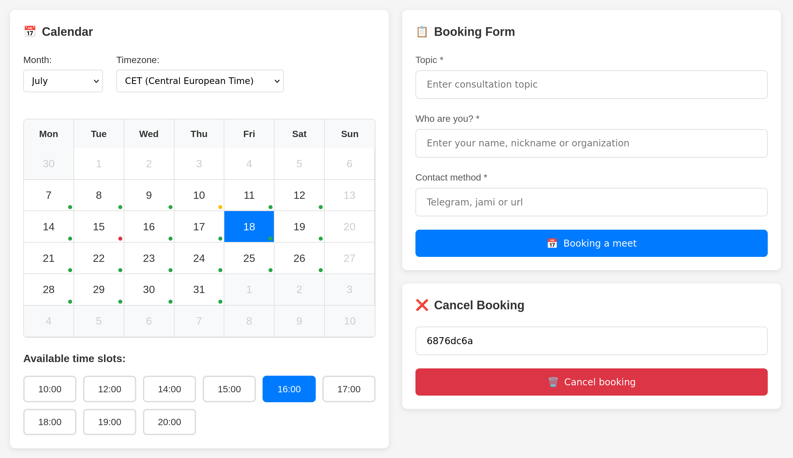

# BookMyMeet



BookMyMeet is a self-contained web application for scheduling meetings with CalDAV calendar integration. Provides a simple appointment booking system with cancellation capability.

## Key Features

- 📅 View available booking slots
- ⏳ Book time slots with meeting topic
- 🔐 Generate booking cancellation codes
- 🌍 Multiple timezone support
- 📱 Mobile-friendly responsive interface
- 🐳 Ready-to-use Docker configuration for quick deployment
- 🔄 CalDAV calendar synchronization

## Installation and Setup

0. Prerequisites:
- Docker and Docker Compose (for deployment)
- CalDAV server (Nextcloud, Davis, Baikal etc.)

1. Clone the repository:
   
   ```bash
   git clone https://github.com/muratovas/bookMyMeet.git
   cd bookMyMeet
   ```

2. Configure environment variables in `docker-compose.yml`:
   
   ```yaml
   environment:
   - CALDAV_SERVER_URL=https://your-calendar-server/dav/calendars/user/
   - CALDAV_USERNAME=your_username
   - CALDAV_PASSWORD=your_password
   - CALDAV_CALENDAR=your_calendar
   ```

3. Start the application:
   
   ```bash
   docker-compose up -d
   ```

The application will be available at: `http://localhost:5000`

## Configuration

Main configurable parameters:

| Environment Variable       | Description                      | Default Value         |
| -------------------------- | -------------------------------- | --------------------- |
| DAYS_AVAILABLE             | Number of days available for booking | 28                 |
| WORKDAY_START              | Workday start time (UTC)         | 8                     |
| WORKDAY_END                | Workday end time (UTC)           | 19                    |
| CALDAV_SERVER_URL          | CalDAV server URL                | -                     |
| CALDAV_USERNAME            | CalDAV username                  | -                     |
| CALDAV_PASSWORD            | CalDAV password                  | -                     |
| CALDAV_CALENDAR            | Primary calendar                 | -                     |
| CALDAV_ADDITIONAL_CALENDARS| Additional calendars             | -                     |

## Usage

1. Open the web interface in your browser
2. Select date and time from available slots
3. Fill the booking form:
   - Meeting topic
   - Your name/organization
   - Contact details
4. Click "Book a meeting"
5. Save the cancellation code (required for cancellation)

To cancel a booking:

1. Enter cancellation code in the corresponding field
2. Click "Cancel booking"
